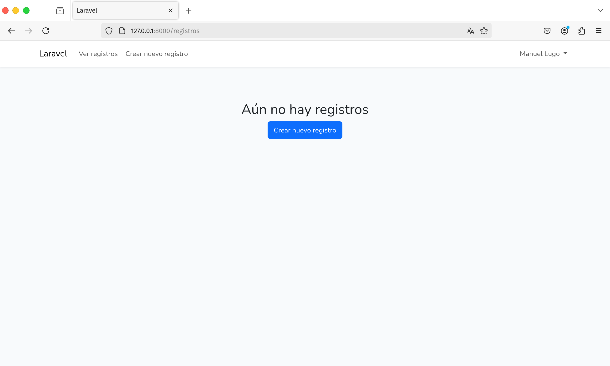
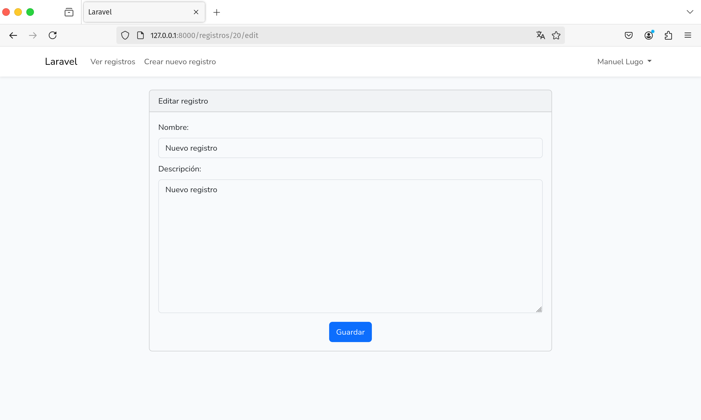

# Prueba de Desarrollo: Aplicación Laravel con Login, CRUD, jQuery y Bootstrap

## Instrucciones de instalación

### Requisitos:
Se debe asegurar que se cuenta con la siguiente versión de PHP y las siguientes extensiones habilitadas:
* PHP >= 8.2
* Extensión Ctype PHP
* Extensión cURL PHP
* Extensión DOM PHP
* Extensión Fileinfo PHP
* Extensión Filter PHP
* Extensión Hash PHP
* Extensión Mbstring PHP
* Extensión OpenSSL PHP
* Extensión PCRE PHP
* Extensión PDO PHP
* Extensión Session PHP
* Extensión Tokenizer PHP
* Extensión XML PHP
* Composer (manejador de paquetes de PHP)

Adicionalmente, es necesario contar con Node >= 18.20.4 para poder utilizar Bootstrap.

### Instalación:
1. Clonar repositorio
```bash
git clone https://github.com/mlugom/prueba-laravel.git
```
2. Ejecutar composer install y npm install en el directorio del proyecto
```bash
cd prueba-laravel
composer install
npm install
```
En caso de recibir algún mensaje de error al ejecutar composer install, es posible que sea por alguna extensión no encontrada. El problema se soluciona habilitando o instalando la extensión que indica el sistema; una vez habilitada, ejecutar nuevamente el paso 2.
3. Crear archivo .env, utilizando como base el archivo .env.example
```bash
cp .env.example .env
```
4. Asegurarse de cambiar los siguientes contenidos en .env
```.env
APP_FAKER_LOCALE=es_CO
```
5. Ejecutar migraciones
```bash
php artisan migrate
```
Es posible que se reciba un prompt indicando que no existe archivo de base de datos, en cuyo caso, basta con indicar 'Yes' o 'Sí'
6. Generar llave de encriptación para la aplicación
```bash
php artisan key:generate
```
7. Ejecutar la aplicación, corriendo de manera simultánea los siguientes comandos en dos terminales distintas:
```bash
php artisan serve
```
y
```bash
npm run dev
```

## Instrucciones de uso
Al abrir la aplicación en un navegador, automáticamente redireccionará a la pantalla de inicio de sesión si el usuario no está autenticado


Se debe proceder a ingresar las credenciales del usuario, o a registrarse en caso de no estar registrado. Para registrarse, se debe dar clic en el enlace de la parte superior derecha.

Se debe tener presente que la contraseña debe igualar o superar los 8 caracteres.

Una vez iniciada la sesión, se mostrará la pantalla de home


En la barra de navegación, se puede acceder a la lista de registros o al formulario de creación de los mismos.


Inicialmente se muestra un mensaje que informa que no hay registros, por lo cuál se deben crear algunos registros primero.

Si se intenta crear un registro con datos faltantes, aparecerá un error y no permitirá crearlo hasta que se corrija.


Tras crear un registro, la aplicación redirige a la pantalla de registros, mostrando un mensaje de éxito en la creación que puede ser cerrado con su respectivo botón.


Los registros se pueden editar y eliminar, tal como se observa. Al dar clic en editar un registro, se mostrará el formulario de edición que coincide en campos con el formulario de creación.


Al terminar la edición del registro, se redirigirá nuevamente a la pantalla de registros, ahora con un mensaje de éxito en la edición del registro.


